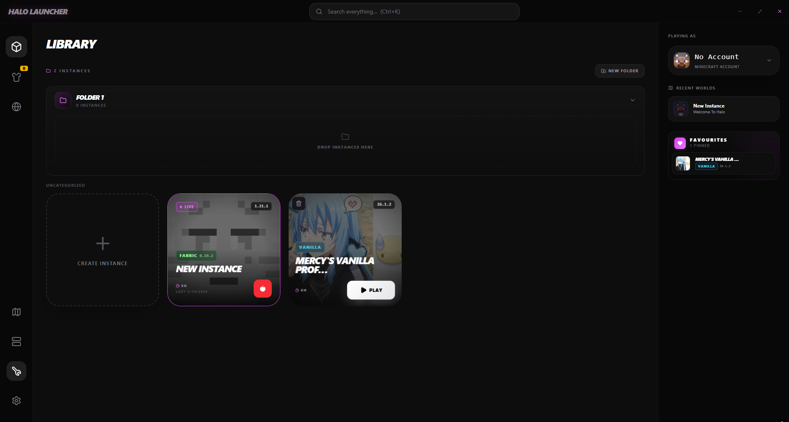
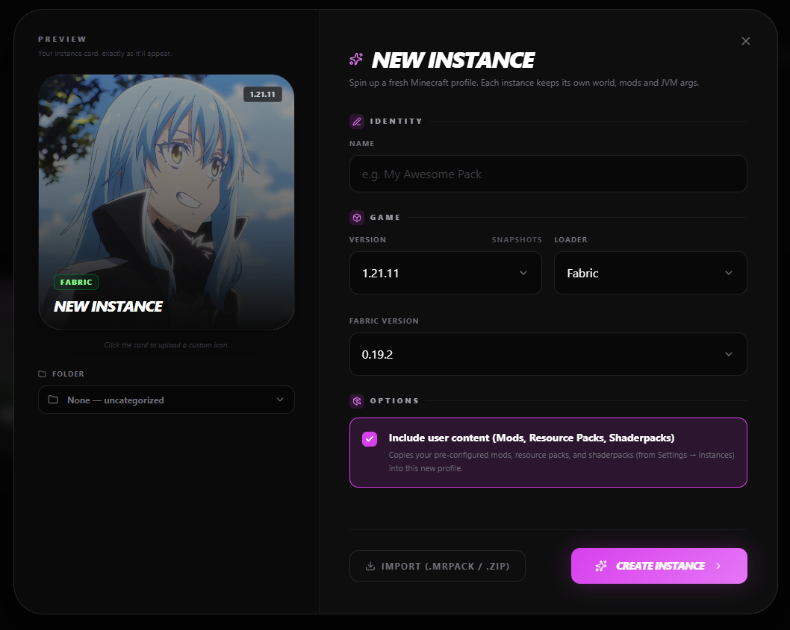
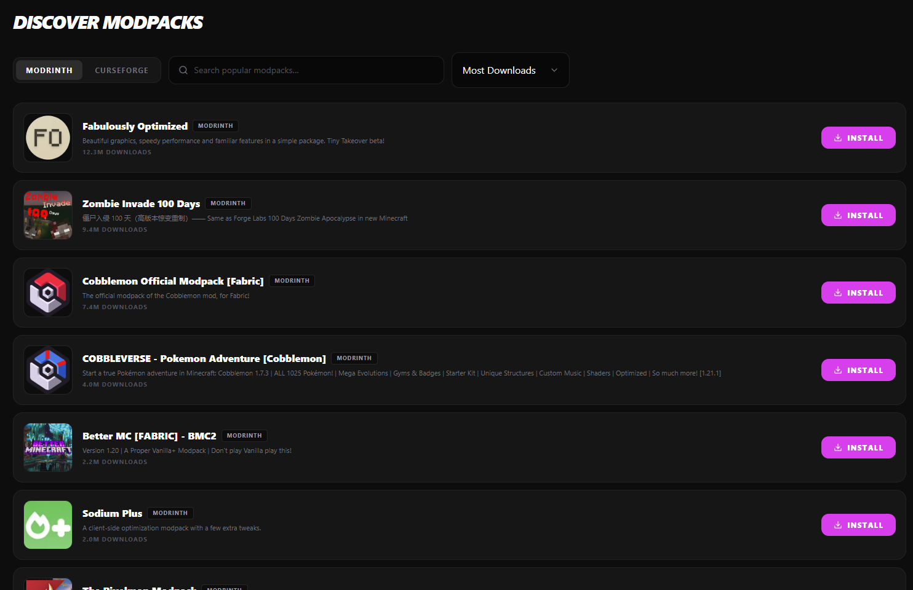

# Halo

**A clean, fast, modern, and slightly silly Minecraft launcher.**

[Download](#-download) · [Features](#-features) · [Screenshots](#-screenshots) · [FAQ](#-faq) · [Roadmap](#-roadmap)

---

## 📖 About

Halo is a lightweight Minecraft launcher focused on removing the friction from modded gameplay. It's fast, simple, and designed to make managing Minecraft instances easier.

It includes quality-of-life features for a smoother experience, with more updates planned.

The UI is modern, responsive, and easy on the eyes — with dark mode by default.

---

## ✨ Features

- Built-in mod browser with automatic dependency installation for all supported Minecraft versions.

- Organize instances with folders, favorites, and one-click community modpack installation.

- Global settings support — configure Minecraft settings once and automatically apply them to all newly created instances.

- Global Mods, Shaders, and Resource Packs — keep your favorite content synchronized across instances without reinstalling them manually.

- Privacy-focused design — Halo stores data locally on your device and minimizes external service dependency.

- Custom instance artwork support, including animated GIFs.

- Custom themes, personalization options, and hidden easter eggs.

---

## 📥 Download

> ⚠️ Halo is still in development — join the [Discord](https://discord.gg/Q99DE8GtmW) for updates.

Current version of the launcher can be found in the [releases page](https://github.com/RimuruElmas/Halo-App/releases).

**System requirements:**
- Windows 10 or later (64-bit)
- 4 GB RAM minimum (8 GB recommended)
- Java will be downloaded automatically if not detected

---

## 🖼️ Screenshots

<!-- Drop ur screenshots in /assets/ and update the paths -->

*Library*

*Instance Creation*

*Modpack Discovery*

---

## 🚀 Getting Started

1. **Download** the latest `.exe` from the [releases page](https://github.com/RimuruElmas/Halo-App/releases)
2. **Run** the installer
3. **Log in** with your account

That's it.

---

## 🛡️ Is it safe?

Short version: **yes**. Halo doesn't store passwords, uses official Microsoft / Mojang auth, and ships with code that's auditable on VirusTotal before you install.

You may see **1–3 detections out of ~70 vendors** on VirusTotal when you scan the installer. This is normal for unsigned indie software — see the FAQ below for the full explanation. The detections[...]

If you want to verify before installing:
- Cross-reference the file hash on the [releases page](https://github.com/RimuruElmas/Halo-App/releases) with what you downloaded
- Upload the `.exe` to [VirusTotal](https://www.virustotal.com/) yourself and look at *which* engines flag it
- Ask in the [Discord](https://discord.gg/Q99DE8GtmW) if anything looks off

---

## ❓ What You May Ask

<b>My antivirus flagged the .exe — should I worry?</b>

 

**Almost certainly not.** Here's what's actually happening:

Halo is an **unsigned** indie installer (a code-signing certificate costs $200–$700/year, which we haven't sprung for yet). Unsigned `.exe` files that do *normal launcher things* trip a small handfu[...]

The detections you'll see look like:

| Vendor | Detection name | What it means |
|---|---|---|
| DeepInstinct | `MALICIOUS` | Pure ML guess, no specific malware family |
| Sophos | `Generic ML PUA (PUA)` | "Potentially unwanted" via generic ML |
| (similar) | `ML/Heur-Suspect` | Heuristic, no signature |

These engines are designed to flag *anything* unsigned that:
- Is an NSIS installer (the standard Windows installer format — Halo uses it)
- Isn't signed by a recognized publisher
- Touches the Windows registry (Halo's "start with Windows" toggle does this)
- Spawns Java processes (the entire point of a launcher)
- Downloads and executes other binaries (auto-updater, asset downloads)

That description fits basically every unsigned indie installer, which is why ML engines lean conservative on them.

If you want to be extra cautious:
- Compare the SHA256 hash on the [releases page](https://github.com/RimuruElmas/Halo-App/releases) with what you downloaded
- Scan the file yourself on [VirusTotal](https://www.virustotal.com/) and look at *which* engines flag it (signature-based hits would be a real red flag; ML-only ones are routine for unsigned software[...]
- Ask in [Discord](https://discord.gg/Q99DE8GtmW)

We may sign future releases with an official code-signing certificate once the project is more mature, which would silence almost all of these false positives.

<b>Why is the source code private?</b>

The launcher itself is closed-source for now. This page exists to provide a trusted download point and info hub.

<b>Does it support mods?</b>

Yes — Halo uses Fabric as its primary mod loader.  
You can still import existing Forge, NeoForge, or any custom modded instances locally.

<b>Will there be a Mac/Linux version?</b>

It's on the roadmap, no ETA yet.

<b>How do I report a bug or request a feature?</b>

Open an issue in this repo, or ping us in the <a href="https://discord.gg/Q99DE8GtmW">Discord</a>.

To verify safety:
- Compare the file hash with the one listed on the <a href="https://github.com/RimuruElmas/Halo-App/releases">releases page</a>
- Optionally scan the file using VirusTotal before running it

---

## 🗺️ Roadmap

- [x] Initial release
- [x] Auto-updater
- [ ] Cross-platform support (Mac / Linux)
- [x] Built-in mod browser
- [ ] Profile sync across devices
- [x] Custom themes
- [x] Skin manager

Suggestions welcome — open an issue or drop ideas in Discord.

---

## 💬 Community

- 💭 [Discord](https://discord.gg/Q99DE8GtmW) — chat, support, announcements
- 🐛 [Issues](https://github.com/RimuruElmas/Halo-App/issues) — bug reports & feature requests

---

## ⚖️ Disclaimer

Halo is not affiliated with, endorsed by, or associated with Mojang Studios or Microsoft. Minecraft is a trademark of Mojang Studios. You must own a legitimate copy of Minecraft to use this launcher.

---

Made with 💙 by the Halo team

